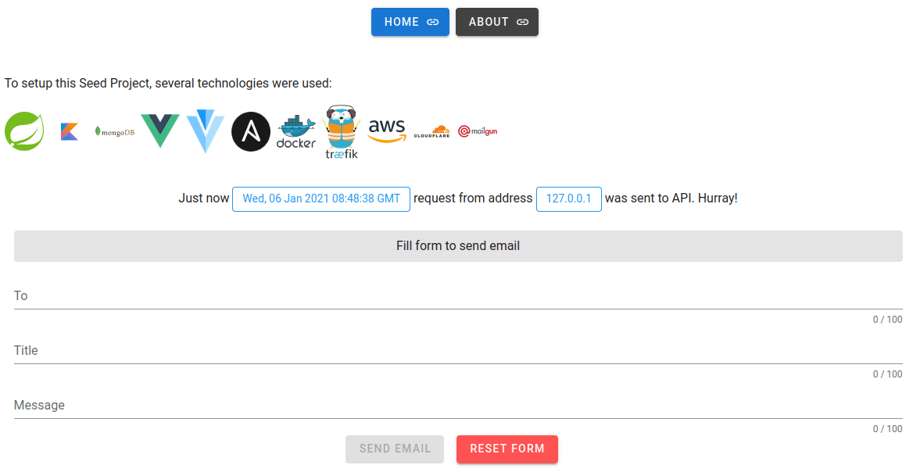
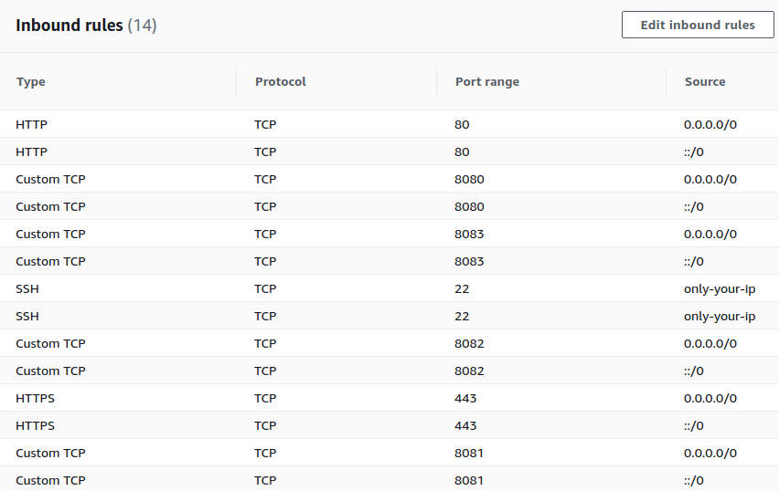
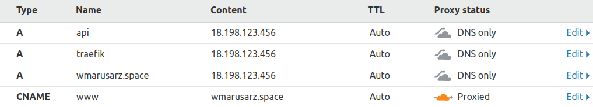
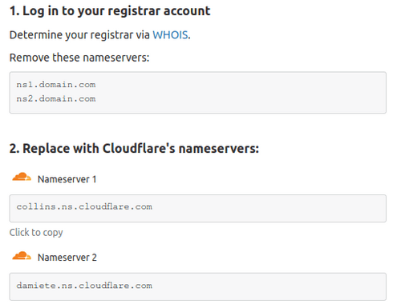
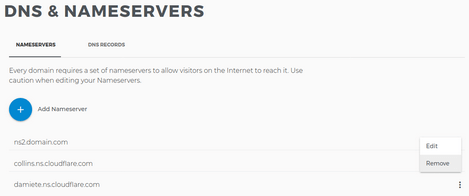
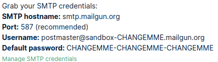

## Readme covers

- [Prerequisites](#prerequisites) - what you need to install to run project
- [Running on localhost](#running-on-localhost) - how to start application, using build tools or docker
- [Setup required for EC2](#setup-required-for-ec2) - how to create AWS account and run EC2
- [Elastic IP address assigned to EC2 instance](#elastic-ip-address-assigned-to-ec2-instance) - how to run application
  on EC2 and access it using IP address
- [Domain assigned to EC2 instance](#domain-assigned-to-EC2-instance) - how to run application on EC2, how to access it
  using domain name, and how to configure SMTP server.

## About

This is a seed project that allows to run API (Spring Boot) and UI (Vue) applications at AWS EC2, deployed with Ansible,
with a minimal setup required. Applications can be accessed by IP or domain name.

Spring Boot application is written in Kotlin. For builds, it uses gradle with plugins: *kotlinter*, *ben-manes.versions*
and *test-fixtures*. Testcontainers is used to test database setup. Spring Security has configured CORS and Basic
authentication - *based on requirements, should be changed to other authentication method ex. JWT*

Deployment process:

1. Ansible configures EC2
1. Ansible builds Spring Boot and Vue application
1. Ansible builds docker images and pushes them to AWS ECR
1. Ansible starts docker containers on EC2
1. All services (spring boot, vue, mongo) run on a single EC2 instance. *If required, please take care about database
   backups.*
1. Traefik is used as a reverse proxy, to route https requests to required containers by domain name.

That's how the application looks in a browser. When the page is opened it sends a request to BE to verify connection.
Additionally, if domain and SMTP server is configured, email can be sent.



## Prerequisites

### Before you start, install at your machine

1. JDK 8+
1. Docker
1. docker-compose
1. Ansible
1. NPM
1. pip3
   ```shell   
   sudo apt install python3-pip
   ```
1. boto3 - required to operate with AWS EC2 and ECR
   ```shell
   pip3 install boto3
   ```
1. AWS CLI2
   ```
   https://docs.aws.amazon.com/cli/latest/userguide/install-cliv2.html
   ```

### Additional setup required

1. Create group docker
   ```shell
   sudo groupadd docker
   ```
1. Add currently logged user to docker group
   ```shell
   sudo usermod -aG docker $USER
   ```
1. Logout and Login
1. Verify that user is added to docker group
   ```shell
   groups | grep docker
   ```

___

## Running on localhost

### Run for development purposes

Use your favourite IDE to start application or execute commands in console

1. Run mongodb service and verify you can log in to mongodb shell:
   ```shell
   mongo localhost:27017
   ```
1. Run Spring Application
   ```shell
   cd seed-spring && ./gradlew bootRun
   ```
1. Run Vue Application
   ```shell
   npm install --prefix seed-vue
   npm run --prefix seed-vue serve
   ```

As a result, you should be able to open application at `localhost:8081` <br>
Request to BE should succeed, it means no errors are displayed, and your local IP with timestamp is displayed.


### Run docker containers locally

*Note: Make sure that mongodb service is stopped, to allow run docker mongodb container*

To run docker containers locally, just execute script:

```shell
sh run-seed-local.sh
```

Scripts `run-seed-local.sh` builds Spring Boot and Vue applications, builds images and runs them.<br>
When script is executed, verify that everything works as expected

```shell
docker ps | grep seed
```

Verify that three containers are up and running:<br>
*seed-spring-vue-aws_seed-vue*, *seed-spring-vue-aws_seed-spring*, *mongo*

As a result, you should also be able to open application at `localhost:8081` <br>
Request to BE should succeed, it means no errors are displayed, and your local IP with timestamp is displayed.


#### Note: Sending emails from localhost

SMTP configuration is mentioned later, in [SMTP config for emails](#smtp-config-for-emails), but if you want to send
email from localhost, create `application-secret.yml` and run application with spring profile: `secret`. File is listed
in `.gitignore` and won't be available in the repository to hide your secrets. Add to `application-secret.yml` file:

```
spring:
  mail:
    username: 'your-smtp-server-username'
    password: 'your-smtp-server-password'
```

___

## Setup required for EC2

If you want to make your application available online, you can deploy it to AWS EC2. This requires minimal
configuration, described below.

**Note: All docker containers (Spring Boot, Vue, Mongo) will be run on a single EC2 instance. It is not recommended for
production applications, but it is enough for fast prototyping. If required, please take care about database backups.**

### Setup EC2

Two access modes to your application deployed on EC2 are available:

1. [Elastic IP address assigned to EC2 instance](#elastic-ip-address-assigned-to-ec2-instance)
1. [Domain assigned to EC2 instance](#domain-assigned-to-EC2-instance)

You can decide how to access your application later. For now, some **AWS setup is required**

1. Login to AWS management console *(create account if you don't have one)*
1. Select region *(it will be used later in configuration file)*
1. Create new EC2 instance *(ex.: Ubuntu Server 20.04 LTS 64-bit (x86), t2.micro)*<br>
   Note: *Select instance with option: Free tier eligible. It means 750 hours each month per year<br>
   Read more about [AWS Pricing](https://aws.amazon.com/ec2/pricing/). Monitor your spendings in AWS console.*
1. For sake of seed project, use default configuration of EC2 instance
1. When prompted, select existing or create a new key pair. Save it to *~/workspace/secret/seed.pem*
   *(It will be required to log-in with ssh to EC2 instance)*
1. Create Elastic IP address and associate it with EC2 instance *(it will be used later in configuration file)*
1. Verify that EC2 is up and running. Connect to EC2 using ssh
   ```shell
   ssh -i ~/workspace/secret/seed.pem ubuntu@[ELASTIC-IP-HERE]
   ```
1. Additionally, configure Security Group assigned to launched EC2.<br>
   Enable Inbound Rules:
    - HTTP 443 *expose https port - required only if you want to access your application using domain*<br>
    - TCP 8080 *expose port for Spring Boot application (required if application accessed by IP)*<br>
    - TCP 8081 *temporarily expose port for Vue application (required if application accessed by IP)*<br>
    - TCP 8082 *expose port (only from your IP) for reverse proxy*<br>
    - TCP 8083 *expose port (only from your IP) for Spring Boot Actuator where you can monitor your application*<br>

That's how it should look like in AWS:



### Setup ansible

Ansible is used to push images to ECR, to configure EC2 and run docker images on EC2. To be able to use ansible, just
define IP address of EC2 instance

1. Add entry to the end of the file: `/etc/ansible/hosts`:

```
[ec2-seed]
89.187.123.456 ansible_user=ubuntu
```

Note: *replace IP address with your Elastic IP*

___

## Elastic IP address assigned to EC2 instance

### Create configuration file for ansible

File `pb-config.yml` is a template for ansible configuration. Copy this file to your home
directory:<br> `~/workspace/secret/env-ip/pb-config.yml` Note: *Path with env-ip is important here, it is used by
ansible*

Replace 'changeme' values with your account details.

```
aws_access_key_id: "changeme"         # format: "AAAAAAAAAAAAAAAAAAAA"
aws_secret_access_key: "changeme"     # format: "aaaaaaaaaaaaaaaaaaaa+aaaaaaaaaaaaaaaaaaa"
aws_region: "changeme"                # format: "cn-location-1"
aws_account_id: "changeme"            # format: "000000000000"
cors_allowed_origin: "changeme"       # format: "http://89.187.123.456:8081" or https://yourdomain.com
vue_app_api_address: "changeme"       # format: "http://89.187.123.456:8080" - your Elastic IP
vue_app_basicAuthUsername: "changeme" # Used to authenticate request using basic authentication
vue_app_basicAuthPassword: "changeme" # Used to authenticate request using basic authentication
```

**Important Note:** **Do not store your account details in template file or any other file in git repository. If you
push your secrets to public repository, your account will be compromised, github will detect it and AWS will block your
account**

### Deploy application

#### Configure EC2 instance

```shell
ansible-playbook playbook-ec2-configure.yml --private-key ~/workspace/secret/seed.pem --extra-vars "seed_hosts=ec2-dev"
```

#### Build docker images and push them to ECR

```shell
ansible-playbook playbook-push.yml --extra-vars "seed_env=env-ip version_tag=1.0.0"
```

#### Run docker images on EC2

```shell
ansible-playbook playbook-run.yml --private-key ~/workspace/secret/seed.pem --extra-vars "seed_env=env-ip seed_hosts=ec2-seed db_setup=false"
```

Note: *Set `db_setup=true` for first run or if you want to reset database. Otherwise, use `db_setup=false`*

#### Verify application running

1. Login to EC2
   ```shell
   ssh -i ~/workspace/secret/seed.pem ubuntu@89.187.123.456 Note: replace ip address with your Elastic IP
   ```
1. When logged in, verify that docker images (`seed-vue`, `seed-vue`, `seed-mongo`) are up and running.
   ```shell
   docker ps
   ```
1. Open application in a browser: http://[ELASTIC-IP]:8081 Note: *replace [ELASTIC-IP] with your Elastic IP*

Note: *Configuration of EC2 instance is required only for the first time. For consecutive deploys, script
`run-redeploy-ip.sh` can be used - it runs `playbook-push.yml` and `playbook-run.yml`*
___

## Domain assigned to EC2 instance

### Domain setup

1. If you don't own a domain, you can buy one.<br>
   I've selected http://domain.com provider because it was the cheapest one.<br>
   **Important Note:** *Turn off domain auto-renewal if you don’t want to be charged every year - price for renewal is
   usually higher*
1. Create email account - *it will be required when https ca certificates will be generated*
1. Create cloudflare account https://www.cloudflare.com/ *(free account available)*.<br>
   Log-in and add DNS entries for your domain. Replace CNAME record with your own domain.

   

1. Allow cloudflare to manage your DNS. Cloudflare provides detailed instruction how to do this, like below

   

1. Point to cloudflare nameservers, at domain.com it can be done like below:

   

1. In cloudflare enable http to https redirection and select option to always use https

Note: *If you're done, you need to wait even up to 24h (usually it is faster), for changes to take effect.*

### SMTP config for emails

Create a mailgun account if you don't have one. Note: *phone number verification is required*. For development purposes,
mailgun offers a free plan - emails to 5 verified email addresses can be sent. No domain configuration is required for
the free plan, because the sandbox environment is used.

From menu: *Sending > Domains* select your sandbox domain, select *SMTP* option, and get your credentials. Value  
*Username* will be used to set *seed_mail_username* and *Default password* will be used to set *seed_mail_password*
in *pb-config.yml*
Other values are configured in *application.yml* and don't have to be changed.



The paid plan may be used if needed, but it requires additional domain configuration. Mailgun provides simple and
detailed instructions on how to do this, and it is not in the scope of this seed project.

### Create configuration file for ansible

File `pb-config.yml` is a template for ansible configuration. Copy this file to your home
directory: `~/workspace/secret/env-domain/pb-config.yml` Note: *Path with env-domain is important here, it is used by
ansible*

Replace 'changeme' values with your account details. Instead of new values (`seed_mail_username` etc...), note
that `cors_allowed_origin` and `vue_app_api_address` has to be changed.

```
aws_access_key_id: "changeme"         # format: "AAAAAAAAAAAAAAAAAAAA"
aws_secret_access_key: "changeme"     # format: "aaaaaaaaaaaaaaaaaaaa+aaaaaaaaaaaaaaaaaaa"
aws_region: "changeme"                # format: "cn-location-1"
aws_account_id: "changeme"            # format: "000000000000"
cors_allowed_origin: "changeme"       # format: "https://yourdomain.com"
vue_app_api_address: "changeme"       # format: "https://api.yourdomain.com" - your domain prefixed with api subdomain
vue_app_basicAuthUsername: "changeme" # Used to authenticate request using basic authentication
vue_app_basicAuthPassword: "changeme" # Used to authenticate request using basic authentication
seed_mail_username: "changeme"        # Set if you want to enable email sending - Read more in section: [SMTP config for emails](#smtp-config-for-emails)
seed_mail_password: "changeme"        # Set if you want to enable email sending - Read more in section: [SMTP config for emails](#smtp-config-for-emails)
traefik_host: "traefik.changeme"      # format: "traefik.yourdomain.com"
api_host: "api.changeme"              # format: "api.yourdomain.com"
ui_host: "changeme"                   # format: "yourdomain.com"
issuer_email: "changeme@yourdomain.com"
```

**Important Note:** **Do not store your account details in template file or any other file in git repository. If you
push your secrets to public repository, your account will be compromised, github will detect it and AWS will block your
account**

### Deploy application

#### Configure EC2 instance

This step is required only once, so if you already did it, you can skip this step

```shell
ansible-playbook playbook-ec2-configure.yml --private-key ~/workspace/secret/seed.pem --extra-vars "seed_hosts=ec2-dev"
```

#### Build docker images and push them to ECR

```shell
ansible-playbook playbook-push.yml --extra-vars "seed_env=env-domain version_tag=1.0.0"
```

#### Run docker images on EC2

```shell
ansible-playbook playbook-run.yml --private-key ~/workspace/secret/seed.pem --extra-vars "seed_env=env-domain seed_hosts=ec2-seed db_setup=false"
```

Note: *Set `db_setup=true` for first run or if you want to reset database. Otherwise, use `db_setup=false`*

#### Verify application running

1. Login to EC2
   ```shell
   ssh -i ~/workspace/secret/seed.pem ubuntu@89.187.123.456 Note: replace ip address with your Elastic IP
   ```
1. When logged in, verify that docker images (`seed-vue`, `seed-vue`, `seed-mongo`) are up and running.
   ```shell
   docker ps
   ```
1. Open application in a browser: http://yourdomain.com Note:

Note: *Configuration of EC2 instance is required only for the first time. For consecutive deploys, script
*run-redeploy-domain.sh* can be used - it runs `playbook-push.yml` and `playbook-run.yml`*

#### Note: after everything, block ports 8080,8081 - make them available only from your IP

___

## Troubleshooting

#### Certificates generation

Note: For development purposes, in `playbook-run.yml` uncomment acme-staging ca server, as shown below:

```
"--certificatesresolvers.myresolver.acme.caserver=https://acme-staging-v02.api.letsencrypt.org/directory"
```

To re-generate certificates, at EC2 remove the old one, and at your machine run `playbook-run.yml` once again. See
traefik logs for verification:

```shell
sudo rm /home/ubuntu/letsencrypt/acme.json
docker logs seed-traefik
```

If everything works fine - no errors should be displayed

#### Troubles with VPN

If you are using VPN, and you run application on localhost with docker images, you may see an error

```shell
Creating network "seed-spring-vue-aws-ec2_default" with the default driver
ERROR: could not find an available, non-overlapping IPv4 address pool among the defaults to assign to the network
```

To make it work, just disconnect from VPN
